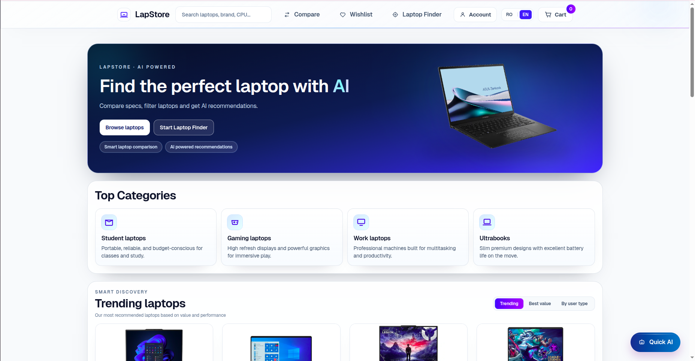
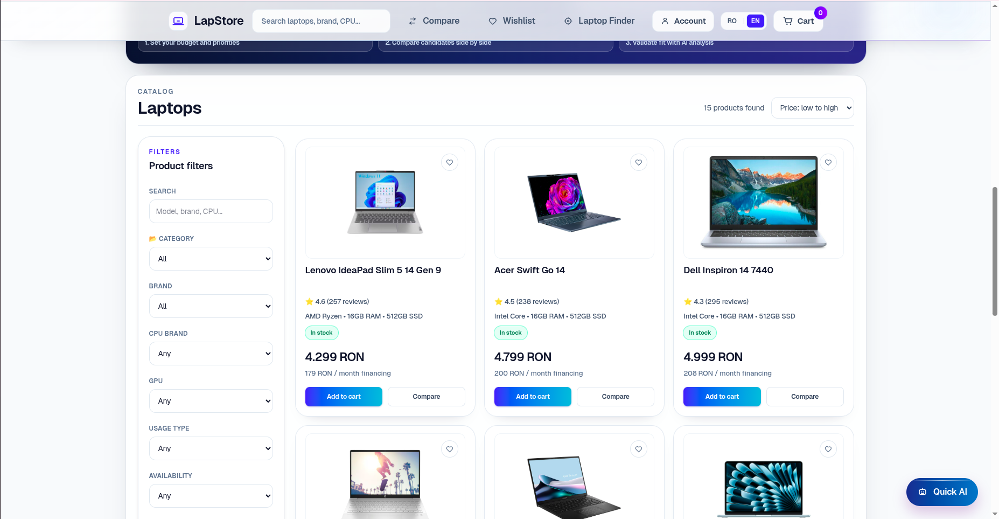
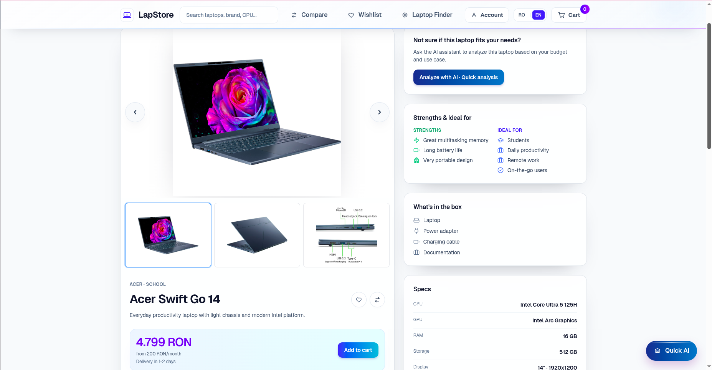
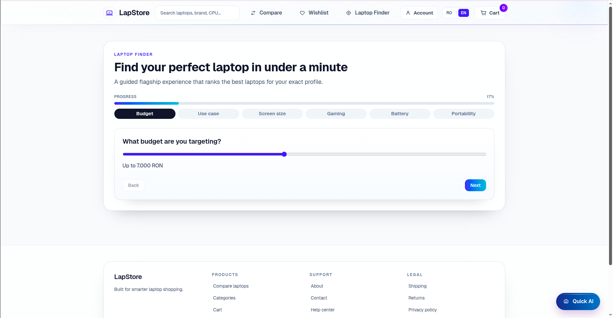
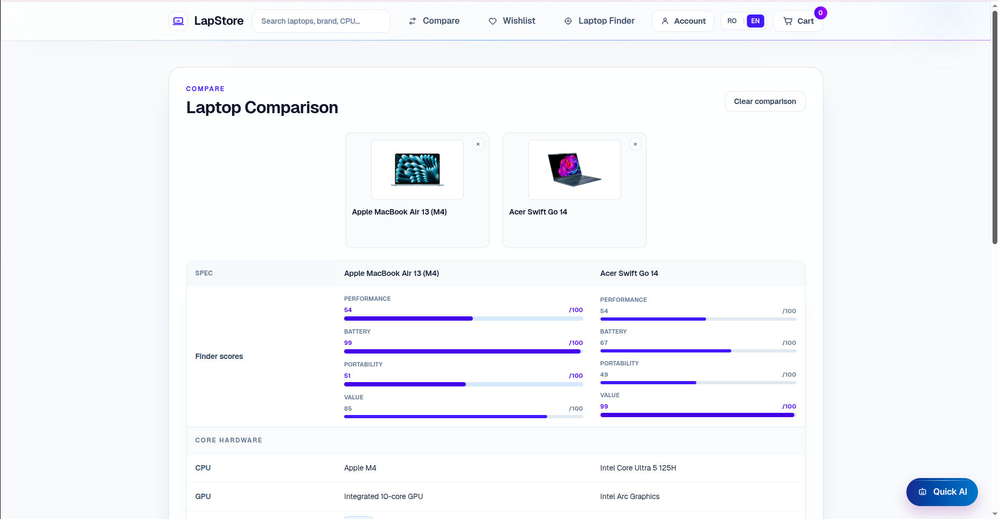

# LapStore – AI Laptop Finder (Full Stack)

LapStore is a full-stack laptop discovery platform composed of:

- **Frontend:** `laptops-frontend` (Next.js + React)
- **Backend:** `fastapi-products-backend` (FastAPI + MySQL)

This root README provides the high-level view of the entire project.

For service-specific details, see:

- Frontend README: [`laptops-frontend/README.md`](./laptops-frontend/README.md)
- Backend README: [`fastapi-products-backend/README.md`](./fastapi-products-backend/README.md)

---

## Table of Contents

- [Project Overview](#project-overview)
- [Features](#features)
- [Tech Stack](#tech-stack)
- [Architecture](#architecture)
- [Project Structure](#project-structure)
- [How to Run Frontend and Backend](#how-to-run-frontend-and-backend)
- [Screenshots](#screenshots)
- [Additional Documentation](#additional-documentation)

---

## Project Overview

LapStore helps users choose the right laptop faster by combining a practical product catalog with AI-assisted guidance.

Users can browse and filter laptops, compare models side-by-side, run a recommendation wizard, and ask a chat assistant for suggestions based on budget and use case.

---

## Features

### User Features

- Laptop catalog with smart filters and sorting
- Product details page with key specs and insights
- AI assistant chat for recommendation and fit checks
- Compare up to 3 laptops side-by-side
- Guided finder wizard
- Wishlist, cart, and checkout flow
- Bilingual UI (English / Romanian)

### Admin / Internal Features

- Admin dashboard for product, order, and analytics views
- Product management workflows (create/edit/delete)
- Demo admin authentication flow for portfolio/demo usage

### Backend Features

- REST API for products and search
- Chat API with rule-based mode and optional OpenAI mode
- Session-aware chat behavior
- MySQL persistence with SQLAlchemy
- Health endpoint and CORS support

---

## Tech Stack

### Frontend (`laptops-frontend`)

- Next.js 15 (App Router)
- React 19 + TypeScript
- Tailwind CSS v4
- Zustand

### Backend (`fastapi-products-backend`)

- Python 3.11+
- FastAPI
- SQLAlchemy
- MySQL (PyMySQL)
- Poetry

---

## Architecture

```text
[ Next.js Frontend ]
        |
        | HTTP (REST)
        v
[ FastAPI Backend ]
        |
        v
[ MySQL Database ]
```

### Main integration points

- Frontend uses `NEXT_PUBLIC_API_BASE_URL` to call backend APIs.
- Backend exposes `/api/v1/products` and `/api/v1/chat`.
- Chat session continuity is managed via `session_id`.

---

## Project Structure

```text
LapStore/
├── README.md
├── laptops-frontend/
│   ├── README.md
│   ├── src/
│   ├── public/
│   └── package.json
├── fastapi-products-backend/
│   ├── README.md
│   ├── app/
│   └── pyproject.toml
├── package.json                # workspace helper scripts
└── scripts/                    # run/stop helper scripts
```

---

## How to Run Frontend and Backend

You can run services separately (recommended while debugging) or from root scripts.

### Option A: Run each service manually

#### 1) Backend

```bash
poetry --directory fastapi-products-backend install
poetry --directory fastapi-products-backend run python -m app.db.init_db
poetry --directory fastapi-products-backend run python -m app.db.seed_laptops
poetry --directory fastapi-products-backend run uvicorn app.main:app --reload --app-dir fastapi-products-backend --env-file fastapi-products-backend/.env
```

#### 2) Frontend

```bash
npm install --prefix laptops-frontend
npm run dev --prefix laptops-frontend
```

### Option B: Use root workspace scripts

From project root (`/home/theodora/LapStore`):

```bash
npm install
npm run dev:frontend   # frontend only
npm run dev:backend    # backend only
npm run dev:all        # both concurrently
```

Also available:

```bash
npm run dev:all:free
npm run stop:all
```

---

## Screenshots

### Homepage



### Laptop Catalog



### Product Page



### Laptop Finder



### Compare



---

## Additional Documentation

- Frontend setup, UI details, and deployment:
  - [`laptops-frontend/README.md`](./laptops-frontend/README.md)
- Backend setup, environment variables, and API examples:
  - [`fastapi-products-backend/README.md`](./fastapi-products-backend/README.md)
